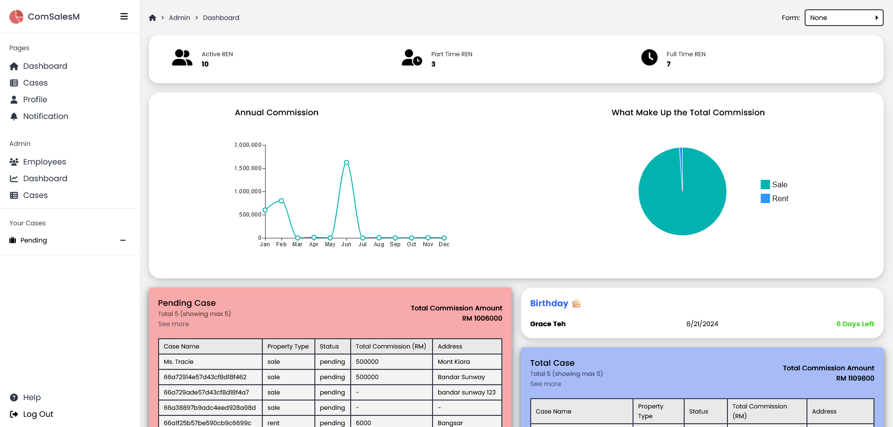

# ComSales Management
ComSales Management is a case commission management web application that enhances the business operation of a real estate company by:
- digitalizing forms
- enable simple case maangement
- enable simple employee maangement
- display analytic data
- enable hierarchy of admin and employee
- provide case commission calculator
- user-friendly UI
- pleasant UX

This is my final year project to create an application or system that bring impact to the community using tech.

## Tools Used
- React
- Sass
- NodeJS
- ExpressJS
- MongoDB
